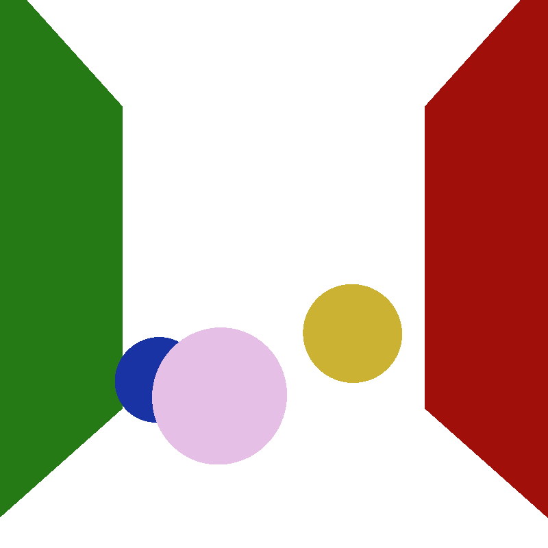
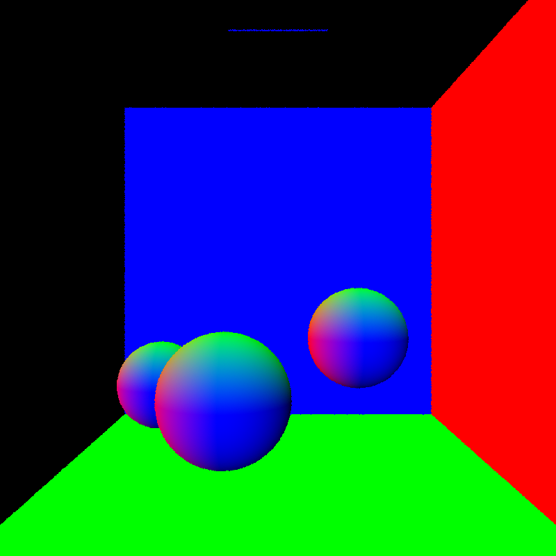
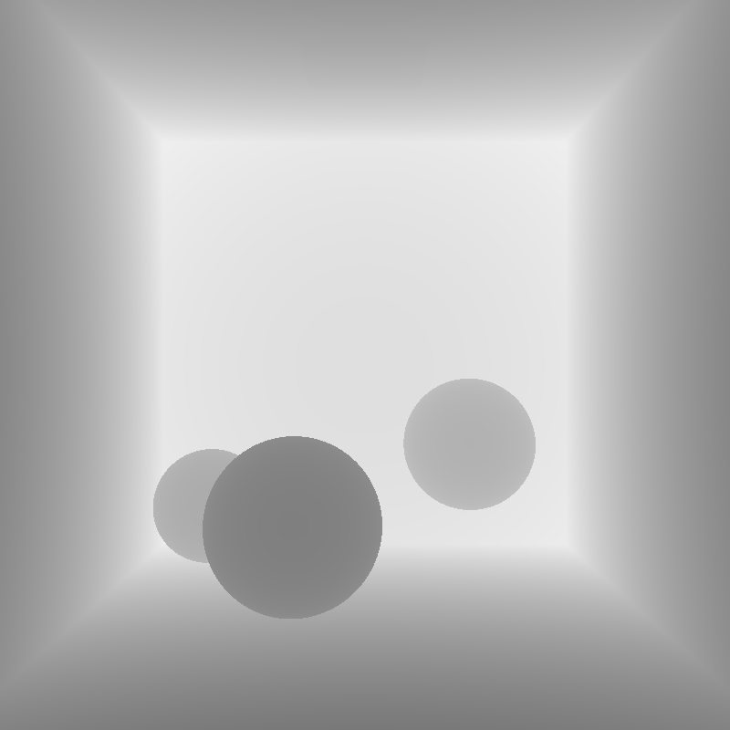

##GPU accelerated Pathtracer

This is a standalone pathtracer implemented on the GPU using CUDA and OpenGL.
###Feature Highlights:
**Diffuse,Reflection, Refraction**

**Global Illumination,Soft Shadow, Caustics, Color Bleeding**

**Depth of Field**

**Subsurface scattering**

**Fresnel Coefficients for reflection/refraction**

**Polygon Mesh Render**

###Results (all 12,000 iterations):

**Subsurface Scattering**

**Depth of Field**

**Polygon Mesh Support**

###Performance Features:

**Ray Parallel**

Threads run on rays rather than pixels. For each pathtrace kernel call, all rays are in the same depth, each thread traces one ray one more depth. The advantage is that for rendering 
that requires very high depth, we could use stream compaction to remove "dead" rays during each kernel call to boost performance.

**Stream Compaction of Rays**

Used thrust::copy_if to do the compaction. Double buffer swapping is used to avoid copy data twice.

###Feature Implementation Explained:

**softshadow,area light,color bleeding,global illumination**

These features come "included" from the core pathtracing algorithm. For each ray, if it hits any surface it will bounce according to the BSDF funtion if returns a color when it hits light or doesn't 
intersect any object or max depth is reached.

**Diffuse,Reflection, Refraction, caustics ("free")**

For diffuse surface, cosine weighted random Hemisphere sample is used to determine scattered direction.
Reflection and refraction uses Fresnel coefficients to determine proportion of reflected and refracted ray.
   Assuming light unpolarized

   

   use 1/2 (RS + RP) to get coefficient for reflection
  
**Depth of Field**

This is achieved by giving eye position an aperture instead of a single point and set image plane at focal length. Camera shoots out random rays within aperture of the eye position.

**Subsurface Scattering**
It is a depth based subsurface scattering approximation. Rays hitting the surface will compute both entry and exit point on the object, then keep tracing from the exit point and the returned color
will be discounted by the distance between entry and exit point by an exponential function. Advantages of this implementation is: little performance impact, and good result of back lit situation. 
Weakness: not physically accurate, and less convincing in front lit situation.	

**Polygon Mesh Rendering**
Implemented triangle intersection test function. Uses TinyObjLoader to read Obj file. 

**Super-Sampling Anti-Alisasing**
Jittered pixel position while shooting camera rays.

###Performance Analysis
The data is produced from a scene in a cornell box and with three spheres, a pure diffuse, a reflective and a refractive one. Resolution was 1024 x 2014.

From the graph we can see when depth is greater than 10, stream compaction begins to be in advantage. The higher the depth the more advantage stream compaction has.
This is probably because when depth is low, overhead and data copying time in stream compaction exceeds the time saved. In addition, I expect stream compaction to have even greater
advantage when the scene is more sparse, i.e. lots of camera rays do not hit anything.

###Debug Images
Debug Intersection of objects and material association.

Debug surface normals of objects

Debug depth of the scene (for debugging depth of field and subsurface scattering)

###Scene Format
This project uses a custom scene description format. See data/scene/.. for example scenes. 
If camera resolution is changed, width and height in init() function in main.cpp needs to be changed as well to properly initiate GUI window.

Materials are defined in the following fashion:

* MATERIAL (material ID)								//material header
* RGB (float r) (float g) (float b)					//diffuse color
* SPECX (float specx)									//specular exponent
* SPECRGB (float r) (float g) (float b)				//specular color
* REFL (bool refl)									//reflectivity flag, 0 for
  no, 1 for yes
* REFR (bool refr)									//refractivity flag, 0 for
  no, 1 for yes
* REFRIOR (float ior)									//index of refraction
  for Fresnel effects
* SCATTER (float scatter)								//scatter flag, 0 for
  no, 1 for yes
* ABSCOEFF (float r) (float b) (float g)				//absorption
  coefficient for scattering
* RSCTCOEFF (float rsctcoeff)							//reduced scattering
  coefficient
* EMITTANCE (float emittance)							//the emittance of the
  material. Anything >0 makes the material a light source.

Cameras are defined in the following fashion:

* CAMERA 												//camera header
* RES (float x) (float y)								//resolution
* FOVY (float fovy)										//vertical field of
  view half-angle. the horizonal angle is calculated from this and the
  reslution
* ITERATIONS (float interations)							//how many
  iterations to refine the image, only relevant for supersampled antialiasing,
  depth of field, area lights, and other distributed raytracing applications
* FOCALLEN (float distance)                                                              //how far is eye position to image plane (for depth of field effect)
* APER (float radius)                                                                    //radius of the size of lens (for depth of field effect)
* FILE (string filename)									//file to output
  render to upon completion
* frame (frame number)									//start of a frame
* EYE (float x) (float y) (float z)						//camera's position in
  worldspace
* VIEW (float x) (float y) (float z)						//camera's view
  direction
* UP (float x) (float y) (float z)						//camera's up vector

Objects are defined in the following fashion:
* OBJECT (object ID)										//object header
* (cube OR sphere OR mesh)								//type of object, can
  be either "cube", "sphere", or "mesh". Note that cubes and spheres are unit
  sized and centered at the origin.
* material (material ID)									//material to
  assign this object
* frame (frame number)									//start of a frame
* TRANS (float transx) (float transy) (float transz)		//translation
* ROTAT (float rotationx) (float rotationy) (float rotationz)		//rotation
* SCALE (float scalex) (float scaley) (float scalez)		//scale

