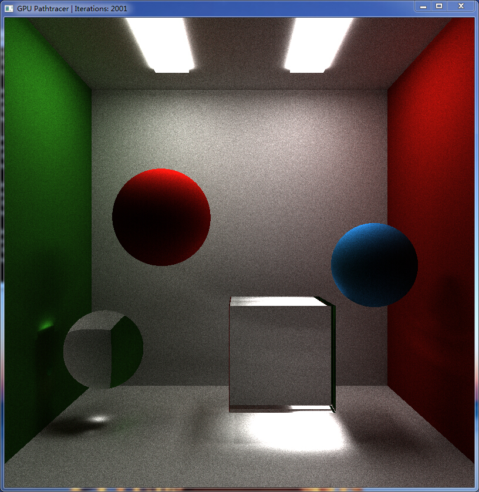
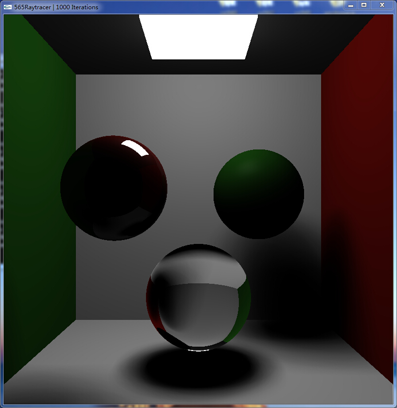
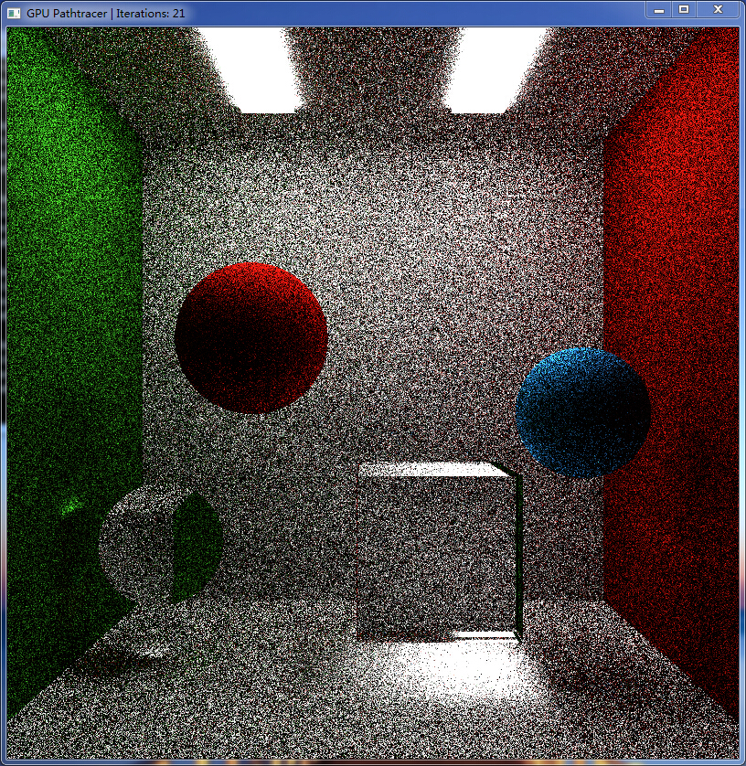
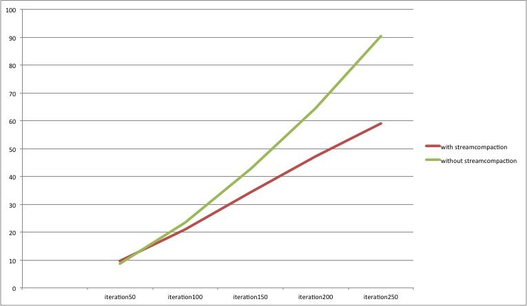
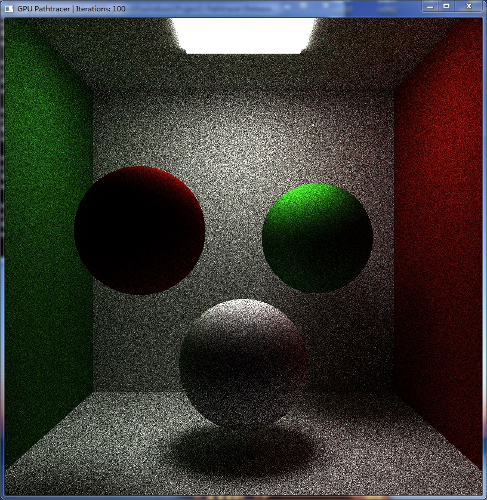
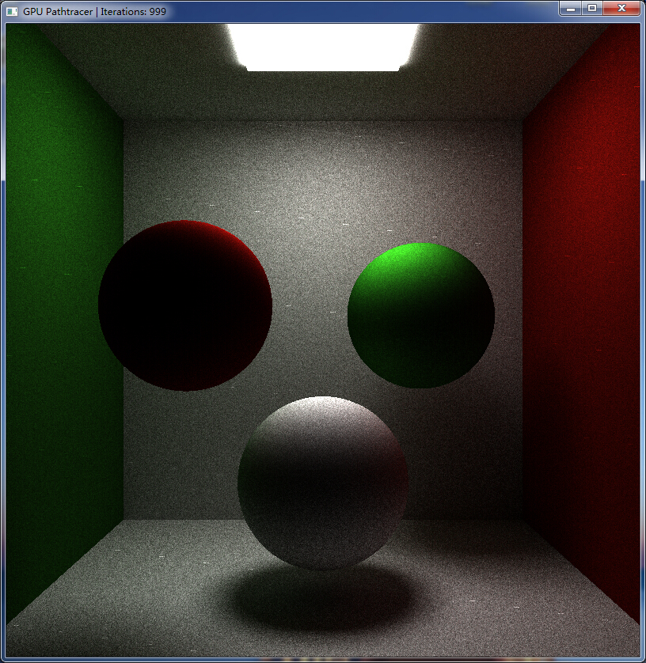
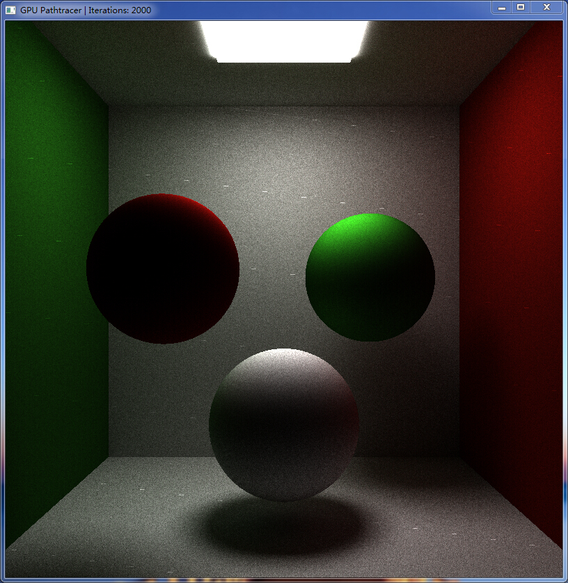

CIS 565 Project3 : CUDA Pathtracer
===================

PROJECT DESCRIPTION
-------------------
This is a GPU CUDA version path tracer, which generate images very quickly compares to CPU version path tracer. It is based on the ray tracing algorithm by tracing rays of light through pixels in an image plane to the scene where light rays can bounce and intersect with geometries.

Based on the given code base, first I have implemented the ray tracing part using recursive algorithm. 
Reference: http://sirkan.iit.bme.hu/~szirmay/ray.pdf

Other helpful reference: http://www.iquilezles.org/www/articles/simplepathtracing/simplepathtracing.htm
http://cs.brown.edu/courses/cs224/papers/mc_pathtracing.pdf

Features Implemented
-------------------
 - Simple Easy Raycasting from a camera to scene
 - Diffuse surfaces
 - Perfect specular reflective surfaces
 - Cube intersection testing
 - Sphere surface point sampling
 - Stream compaction optimization

Extra Features
-------------------
 - Refraction, i.e. glass
 
 
 
 
 - Interactive Camera (Show in the video)
 
Performance Analysis
-------------------
 - Stream Compaction
 Using stream compaction method to dynamically kill inactive rays and keep the wanted rays in the tracing program. The datatable and image shows the difference w/o stream compaction.

Time(ms)/scene2,10 maxDepth	  iteration 50		iteration 100		iteration 150  		iteration 200		iteration 250

with streamcompaction			      9.63			        21.12			      34.27            47.09		        58.97

without streamcompaction		    8.66			        23.56			      42.75		         64.51		        90.32	

 - Images of the sample Scene

 
Vedio Link
-------------------
http://youtu.be/63mpQzdkslI
