CIS 565 Project 3: CUDA Pathtracer
==================================

* Kai Ninomiya (Arch Linux/Windows 8, Intel i5-4670, GTX 750)

Keybindings
-----------

* Escape: save image and exit program
* Space: save image early and continue rendering
* Arrow keys: rotate camera
* WASDRF keys: fly through space laterally (WASD) and vertically (RF) relative
  to the camera orientation

Base Code Features
------------------

* Configuration file reading
* Hemisphere sampling function (for diffuse)
* Objects: sphere

Features Implemented
--------------------

* Pathtracing algorithms
* Materials: diffuse, reflective, **refractive with Fresnel reflection**
* Camera: **movement** (controls above), **antialiasing**, **depth of field**
* Objects: cube, sphere **with correct normals when scaled**
* Performance: ray-level stream compaction

(Extras in **bold**.)

Renderings
----------

Combined test render:
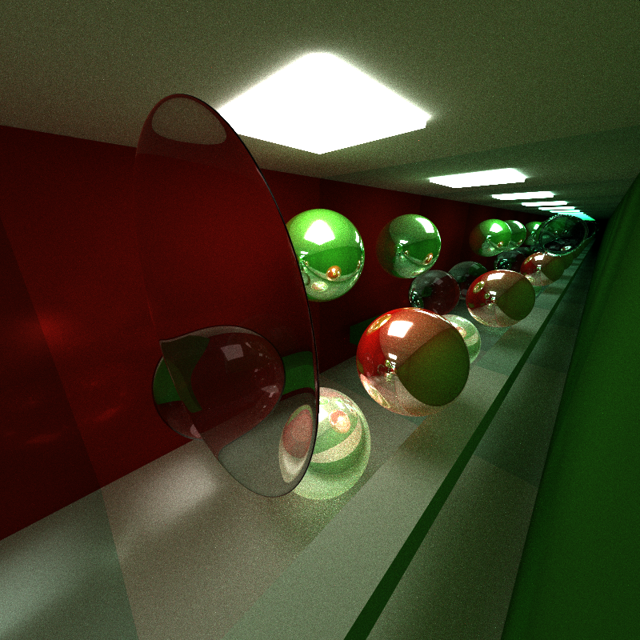

Annotated:

With depth of field:
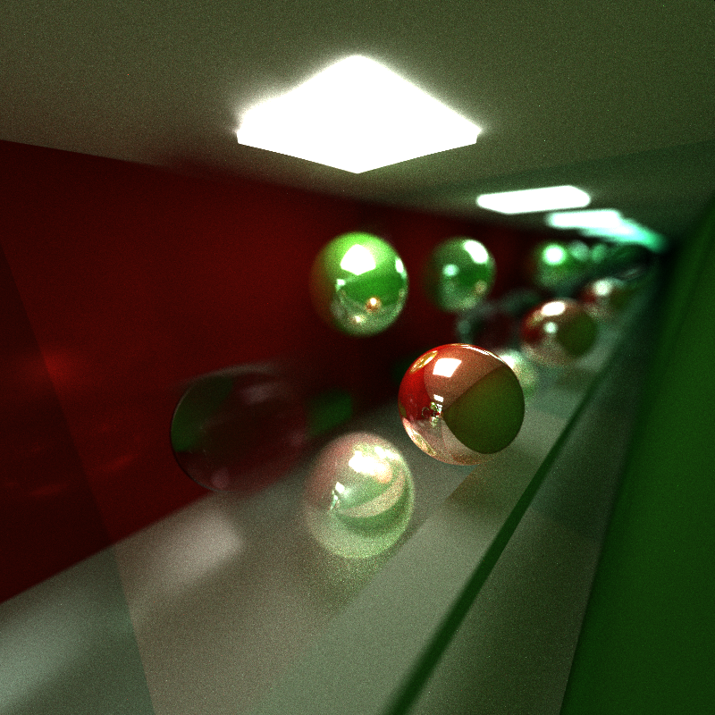

Performance
-----------

### Stream Compaction

In order to perform ray-level stream compaction, it was necessary to refactor
the rendering kernel into a single-ray step along the path. The result of this
is significantly more overhead, due primarily to performing stream compaction
between every step. At low path depths (e.g. 4), performance is lower with
stream compaction. However, stream compaction allows for extremely high path
depths (tested up to 1000) without very significant performance degradation.
This is because the vast majority of paths have terminated, and dead paths no
longer use kernel threads.

| Path Depth |    Before |     After |
| ----------:| ---------:| ---------:|
|          2 |  33.20 ms |  49.86 ms |
|          4 |  66.54 ms |  83.20 ms |
|          8 | 116.55 ms | 116.56 ms |
|         16 | 216.54 ms | 133.20 ms |
|         64 | 327.1x ms | 149.90 ms |
|        256 | 418.xx ms | 183.22 ms |
|       1024 | 660.xx ms | 300.23 ms |

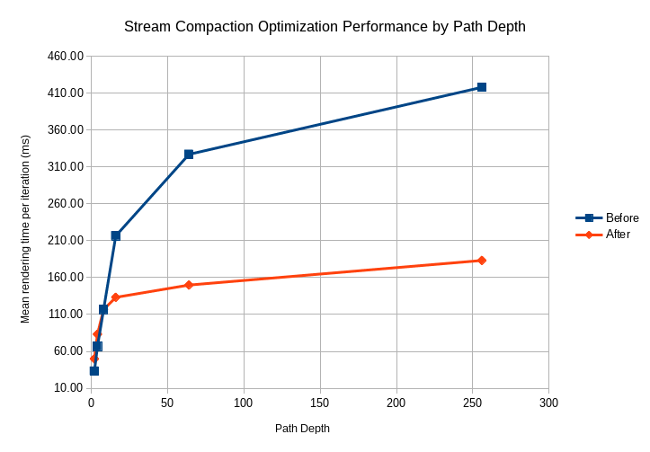
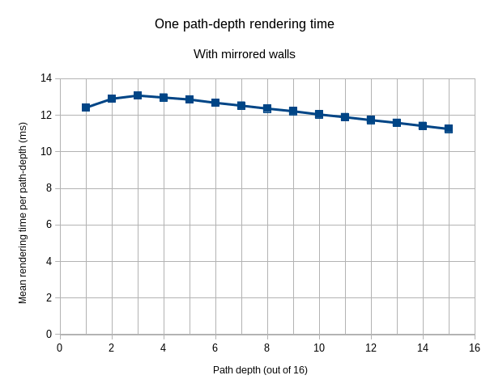
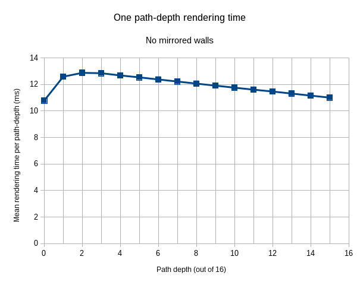

### Block sizes (with compaction)

This plot is remarkably uninteresting (beyond the expected low performance of
block sizes which are not multiples of the warp size of 32).
This is probably due to the fact that shared memory was not used at all.

With a block size of 512, performance becomes marginally worse.
This may be due to the increased number of registers used, since the number of
registers per thread is high (111).  This may be also due to caching effects:
at this block size, a lot of data is being loaded for each block, so the cache
may not be able to hold everything effectively.

With a block size of 1024, the kernel does not run due to insufficient
resources.

| Block size |    Time  |
| ----------:| --------:|
|         16 | 399.9 ms |
|         32 | 266.5 ms |
|         33 | 416.5 ms |
|         48 | 316.5 ms |
|         64 | 266.5 ms |
|         65 | 349.3 ms | 
|         80 | 299.9 ms |
|         96 | 266.5 ms |
|        128 | 266.5 ms |
|        256 | 266.5 ms |
|        512 | 271.3 ms |

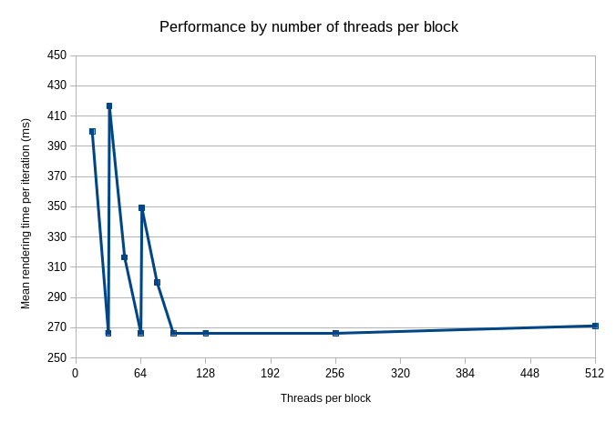

### Cube Intersection

Initially I did cube intersection naively, but this turned out to use 
many GPU registers and had very bad performance. Rewriting based on Kay and
Kayjia's slab method increased performance significantly:

|    Naive |    Slabs |
| --------:| --------:|
|  102 reg |   95 reg |
| 83.21 ms | 66.54 ms |

Features
--------

### Diffuse materials

Rays bounced randomly according to provided hemisphere sampling method.

**Performance:**

|   Before |    After |
| --------:| --------:|
|   55 reg |  103 reg |
| 16.55 ms | 66.55 ms |

### Reflective materials (non-Fresnel)

Rays always reflected perfectly.

**Performance:**

|   Before |    After |
| --------:| --------:|
|  103 reg |  102 reg |
| 66.55 ms | 66.55 ms |

### Refractive materials (non-Fresnel)

Rays always refracted perfectly. Required some additions to the intersection
code

**Performance:**

|   Before |    After |
| --------:| --------:|
|  102 reg |  101 reg |
| 66.55 ms | 99.88 ms |

Extras
------

### Antialiasing

Samples are taken randomly from within each pixel. See Earlier Renders section
for comparison.

**Performance:** Negligible impact.

*Mean rendering time per iteration for an arbitrary example scene*

|   Before |    After |
| --------:| --------:|
|   95 reg |   95 reg |
| 33.19 ms | 33.19 ms |

### Depth of Field

Origin and direction of camera rays is varied randomly (in a uniform circular
distribution) to emulate a physical aperture.

**Performance:** Some impact per-sample when adding the implementation.
This is due to additional randomness calculations and vector math for computing
random rays.  Depth of field also increases the number
of samples needed for visual smoothness due to the extreme variation between
samples. Implementation-wise, this is identical to analogous CPU code.

*Mean rendering time per iteration for an arbitrary example scene*

|   Before |    After |
| --------:| --------:|
|   95 reg |   95 reg |
| 49.87 ms | 61.6x ms |

### Fresnel Reflection/Refraction

I used Schlick's approximation to compute the fractions of light
reflected/refracted, then used that as a probability for the next path ray.

Reflection is implemented using glm::reflect.  Refraction uses glm::refract and
handles total internal reflection. Intersection code was modified to report
whether the intersection was inside or outside the object, which allows correct
handling of indices of refraction at interfaces. (This technically could have
been done by adopting a different normal direction convention and checking
dot products with that, but this is more readable.)

(See debug render in the Debug Renders section below.)

**Performance:** Some performance impact per-sample. This is probably due to
the additional Fresnel factor computation and the additional random branch
calculation based on that factor.

*Mean rendering time per iteration for an arbitrary example scene*

|   Before |    After |
| --------:| --------:|
|  101 reg |  101 reg |
| 233.2 ms | 249.9 ms |

### Camera movement

Keys for this are listed in the Keybindings section. This is implemented by
simply modifying the location of the camera, clearing the render, and starting
again.

### Scaled Sphere Normals

This is a minor thing, but I fixed the provided code to use inverse transpose
transformations to calculate the sphere normals.

(Error image in bloopers.)

|   Before |    After |
| --------:| --------:|
|  101 reg |  111 reg |
| 250.2 ms | 266.5 ms |

Parameter Comparison Renderings
-------------------------------

Higher iteration counts always improved image smoothness, since more samples
were averaged over time. Higher path depths seem to correspond with bright
spots which never get optimized out, for some reason.

Depth 16, 500 samples:

Depth 16, 2000 samples:

Depth 256, 500 samples:

Depth 256, 2000 samples;

Earlier Renders
---------------

Diffuse-only:
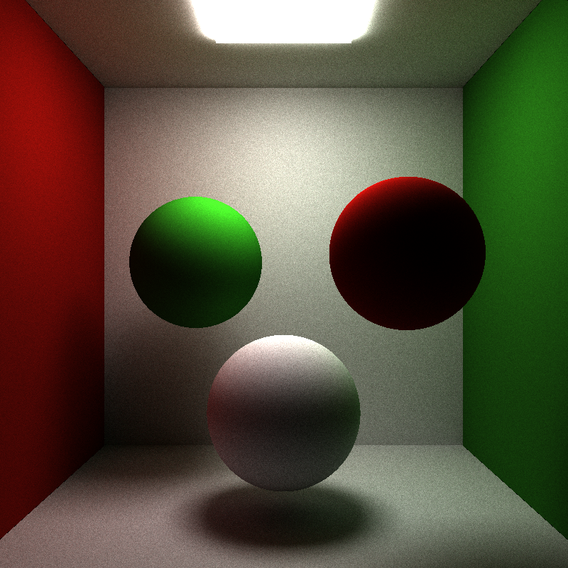

Diffuse + Reflective:
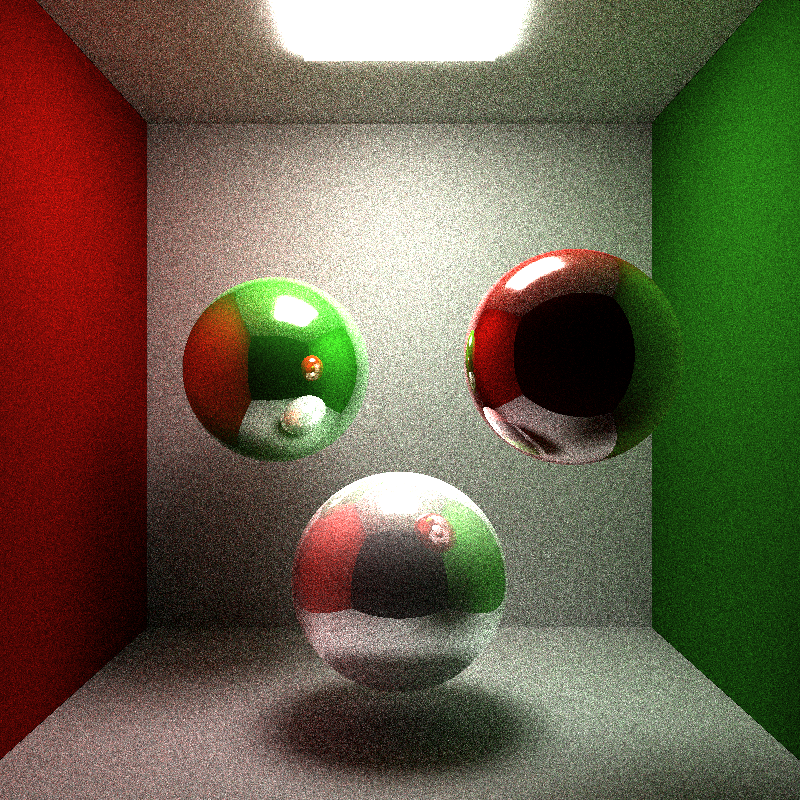

With Direct Lighting, depth=8 (not included in final version):
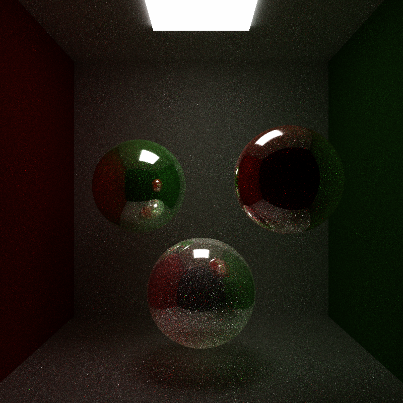

With Direct Lighting, depth=1 (not included in final version):
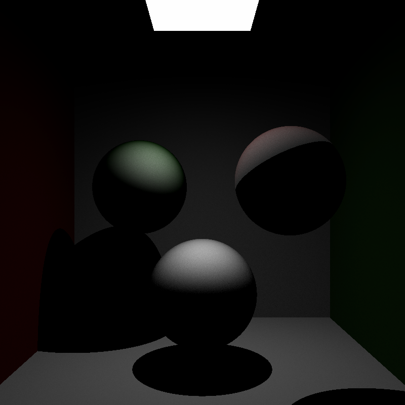

Same image with antialiasing:

Debug Renders
-------------

Normals:
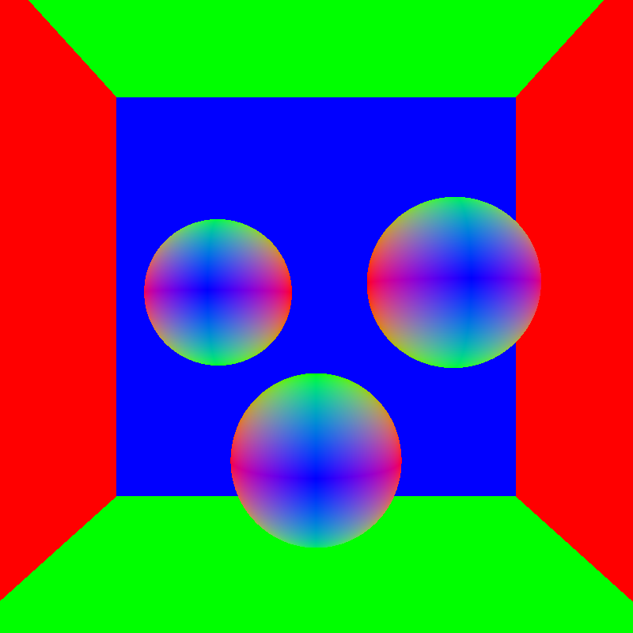

Positions:
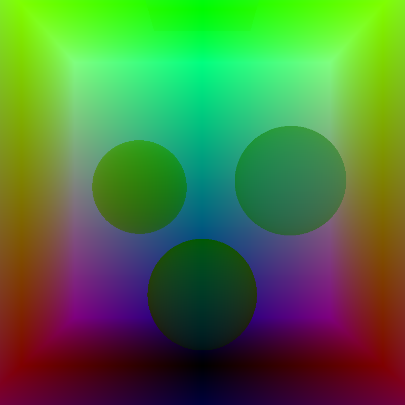

Materials/emittance:
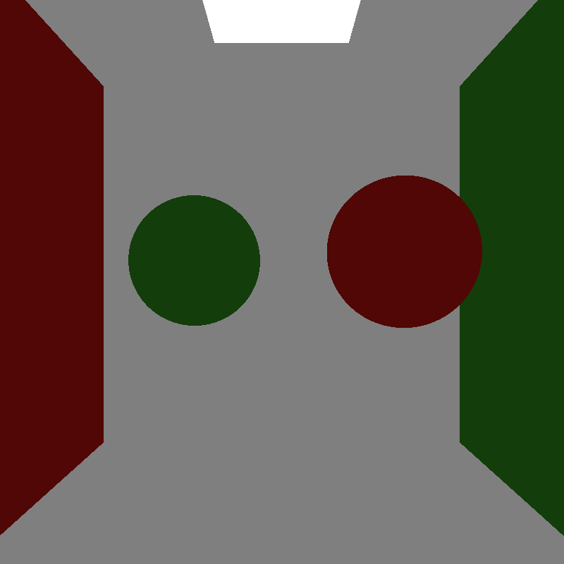

Direct lighting lit areas (not included in final version):
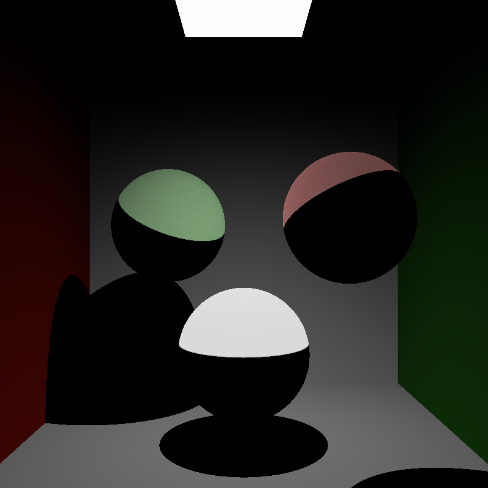

Fresnel reflected light factor (shown here for all reflective surfaces, but to
be only applied to refractive surfaces):
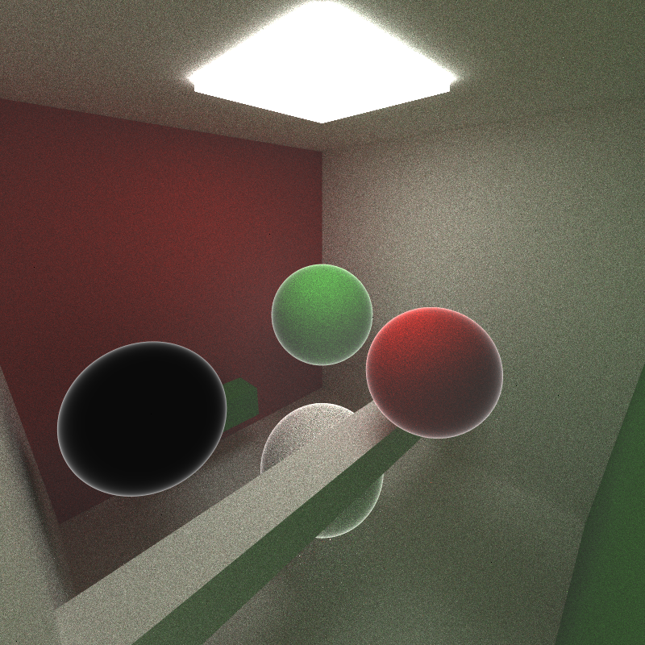

Bloopers
--------

Seed error:
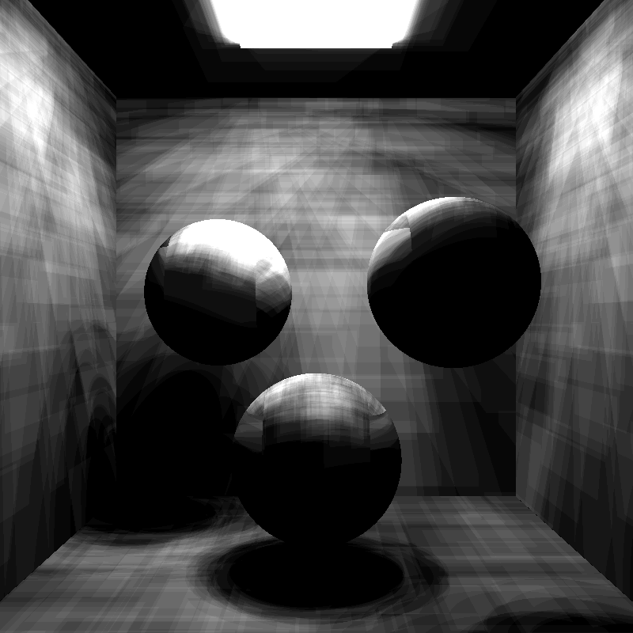

Code refactoring error:
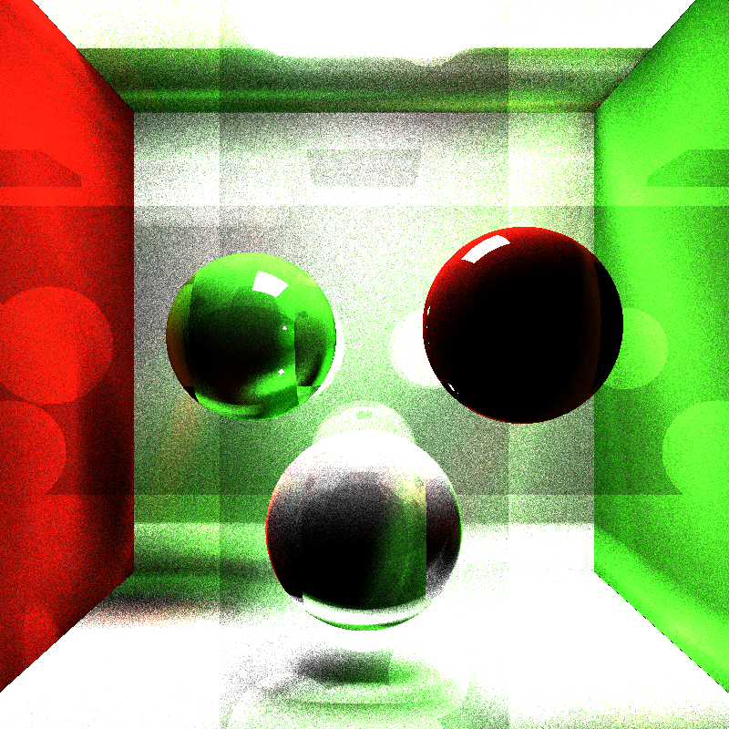

Sphere normal error (from provided code):
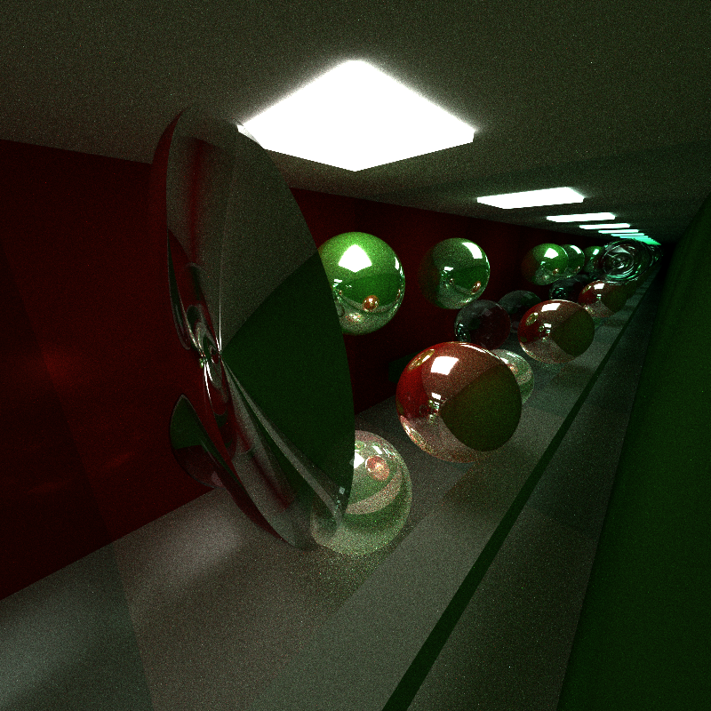
