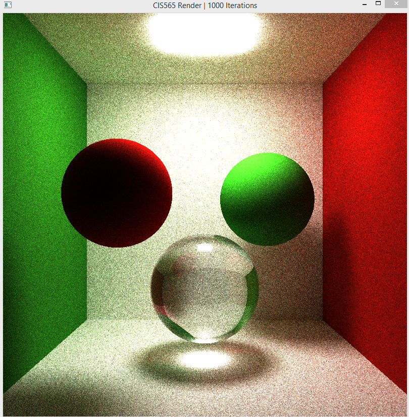

CUDA Pathtracer (developing)

This is a standalone pathtracer implemented using CUDA and OpenGL.

#Features Implemented:
Fresnel Coefficients for reflection/refraction
Assuming light unpolarized

use 1/2 (RS + RP) to get coefficient for reflection

#Result:

#Performance

Bugs to fix: cube intersection/normal problem when dimension <= 0.01
	      output image doesn't match OpenGL rendering

