##Result:

#Compare the different iteration number:
* Iteration Number: 100

* Iteration Number: 200

* Iteration Number: 500

* Iteration number: 1000
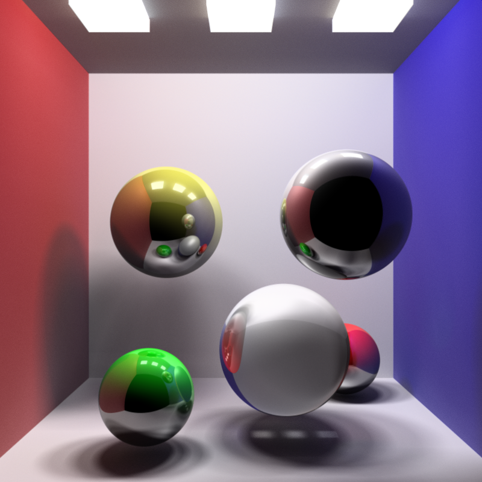

* Iteration number: 5000

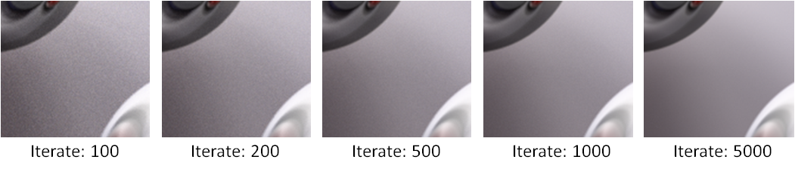
Conclusion:  
The effect of increasing the iteration number is obvious. However, the difference of results of iteration number higher than 5000 are hard to be distinguished by eye.

##Compare the different depth of trace:
* Depth of trace: 3
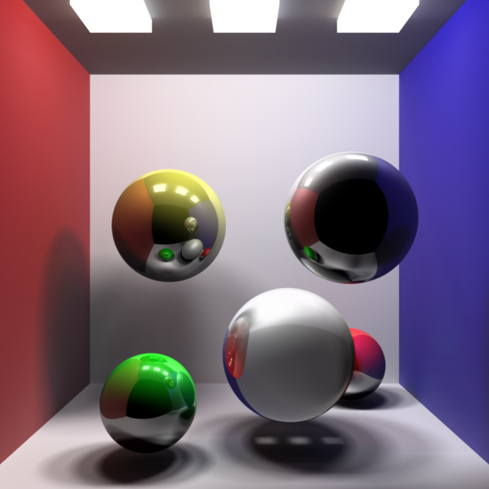

* Depth of trace: 5

* Depth of trace: 10

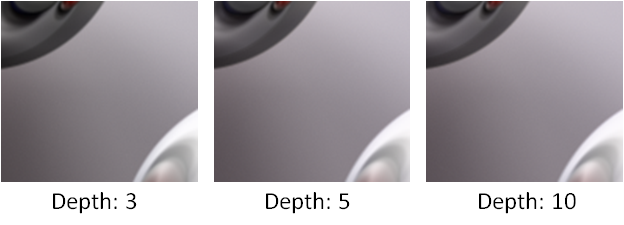
Conclusion:  
The difference between depth 3 and depth 5 is distinguishable, but the difference between depth 5 and depth 10 is almost nondistinctive. Since I provide a indirect influence coefficient 0.5 to do my path tracer. And this coefficient represents the influence rate from the indirect radiance to the direct radiance.
Besides, our color RGB value is from 0~255, that means even the 5th depth has dramatical color change from RGB(0,0,0) to RGB(255,255,255), it would only cause RGB(8,8,8) color change in our result. 

##Anti-aliasing effect:
For the general sampling, we cast ray from camera location through each pixel center.
For the anti-aliasing sampling, we still cast ray from camera locatin but not exactly through pixel center every time. Our ray will past through a random point inside a given distance from the pixel center.
If we are doing the simple ray tracer, the anti-aliasing will increase the computation loading dramatically because we need to cast multiple rays for each pixel instead of only casting a single ray. 
However, while we are doing the path tracer, we have to sample a pixel multiple times essentially. We could almost get anti-aliasing effect for free.
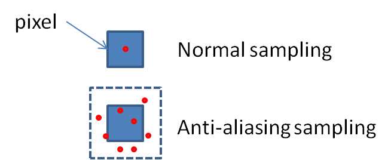
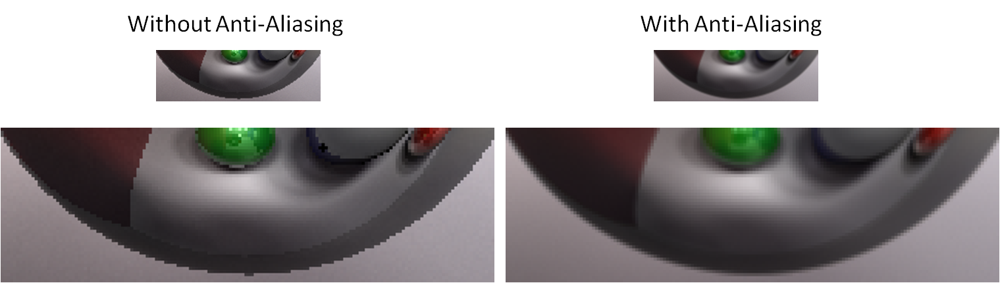

##Fraction effect
* Change different refraction rate 2.6

* Compare with CPU version:  
There is no difference to implement this feature in CPU or GPU.

##Change specular exponential:
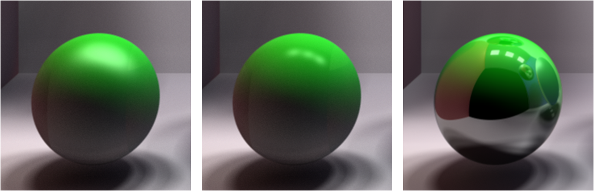

##Depth of field effect:
* Description:  
The way that I used to create the depth of field effect is to set up a focal length and apperture radius. The first step is to cast the initial ray from camera position and past throught the pixel which we want to sample.
Then, use the focal length to compute the focal point start from camera center along the initial ray. Following, generate random point on the circular plane which is centered on camera position. Lastly, cast ray from the random point and past through the focal point and use this ray to do the sampling.
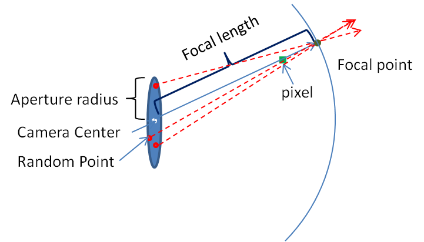

* Focal length:10  Aperture radius: 0.2

* Focal length:10  Aperture radius: 0.5

* Focal length:14  Aperture radius: 0.2

* Compare with CPU version:  
It is not reasonable to use the same method to create the depth of field effect in CPU version. I think it is still doable, but the required rendering time might be hundred times greater than the original rendering.  
* Further improvement:  
Add more lens effects such as Fisheye lens or Wide-angle lens might be an interesting next step. 

##Motion blur effect:
Motion blur effect is easy to implement. We could move the object every certain frames and do our general path tracer. Then we could get the motion blur effect for free.
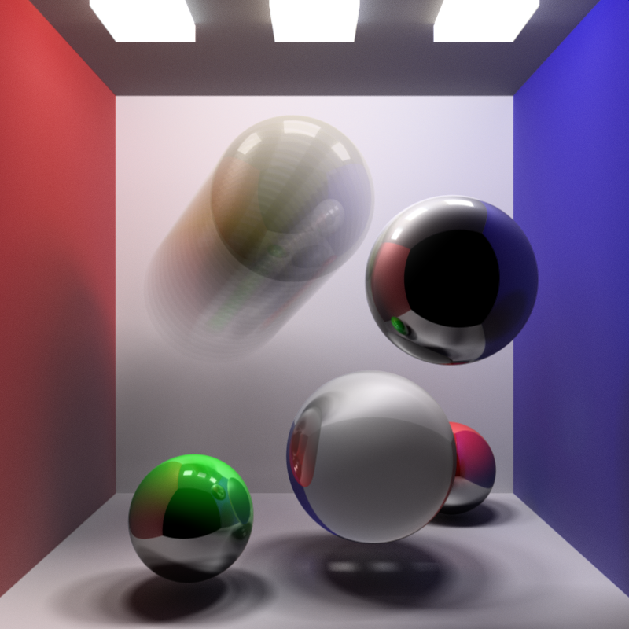
* Compare with CPU version:  
Similar to the analysis of depth of field effect, the motion blur effect is doable in CPU but not reasonable to implement.

* Further improvement:  
I will try not only move the normal object but also move the light source to create a trace of light effect.

##Change view direction and camera interaction:
In my program, user could easily control the camera with keyboard.
* Use "A", "D" to move camera position along X axis.
* Use "W", "S" to move camera position along Y axis.
* Use "Z", "C" to move camera position along Z axis.
* Use "Q", "E" to rotate camera angle along up axis.
* Use "T", "B" to rotate camera angle along lateral axis.
* Use "P" to toggle the depth of field effect.
* Use "I", "O" to adjust the camera the focal length.
* Use "L", "K" to adjust the camera the apperture radius.
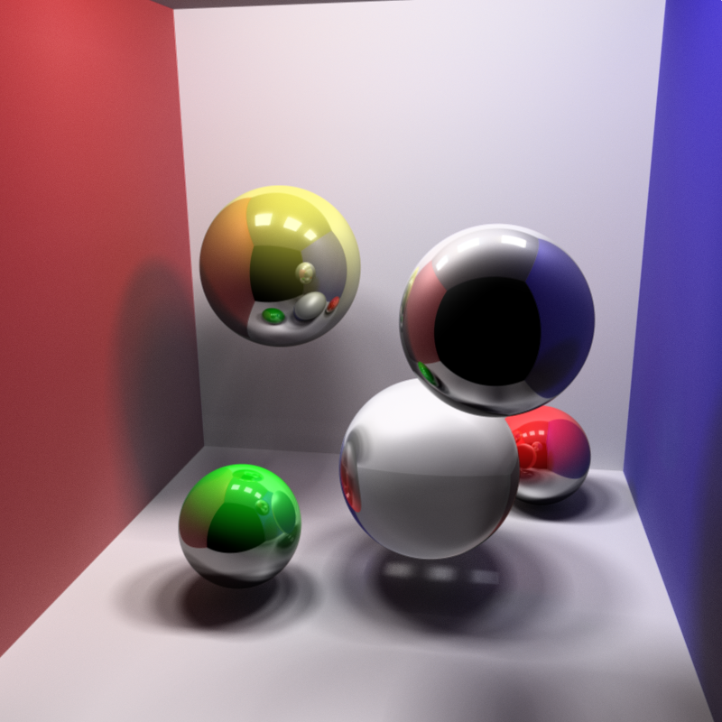
* Compare with CPU version:  
This feature in CPU will not be any different.

##Mesh Object:
* Bunny: 4968 faces  
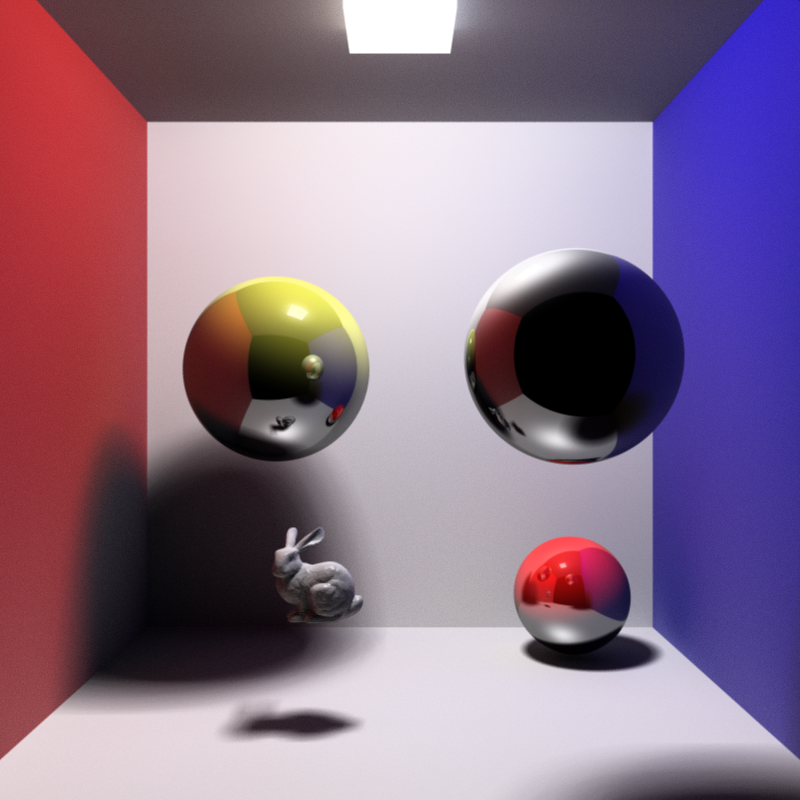
* Further improvement:  
Although I have used a bounding sphere to reduce the computation loading, it is still a time consuming process. Find a good way to further reduce the rendering time would be extremely valuable. Besides,
my program currently could only read one obj file. Modify the program to be able to load multiple obj files is also an important issue.
* Compare with CPU version:  
There is no difference to implement this feature in CPU version. The only concern is that the required rendering time would be crazy.

##Texture mapping effect:
This program could read a bmp format image and store all the pixel colors in a color buffer. Then, when I am doing the path tracer, I could read the color according to the intersection point position. 
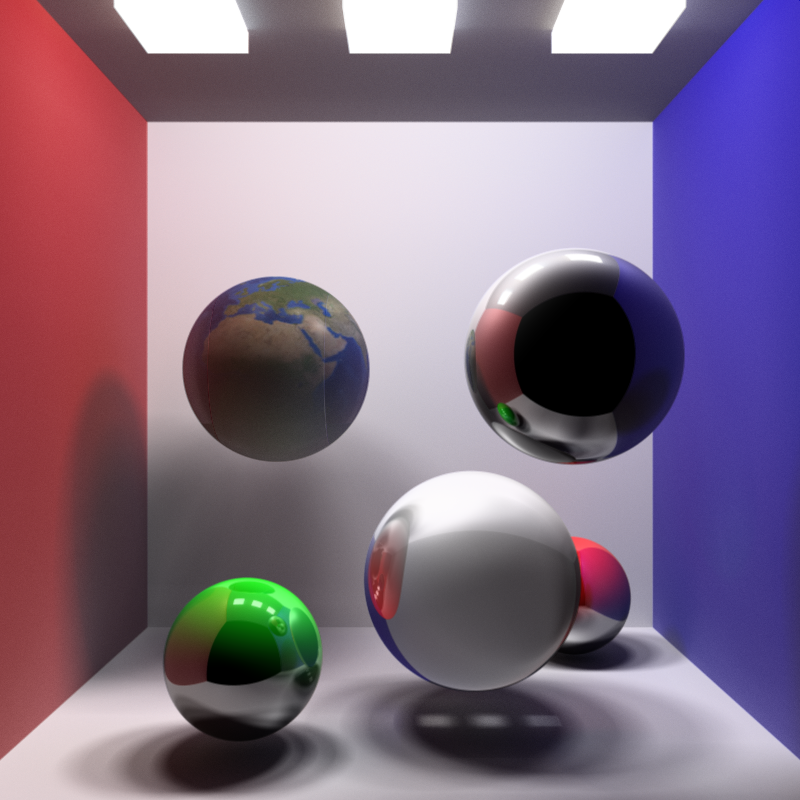
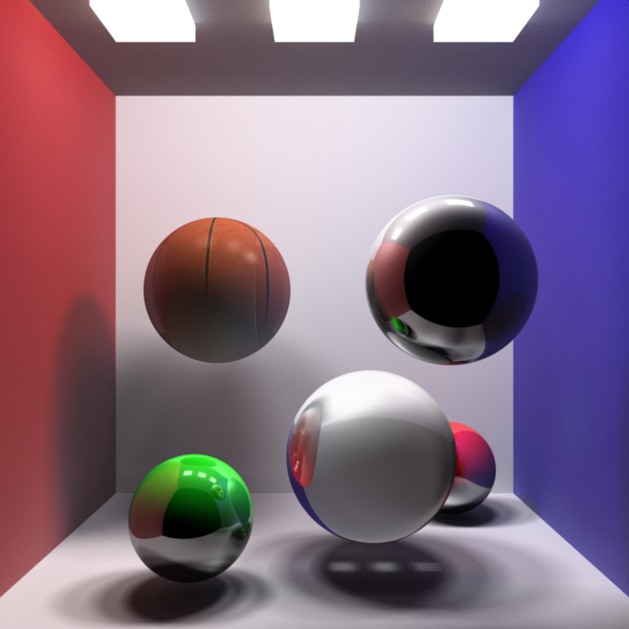
* Compare with CPU version:  
This feature in CPU is doable and the required time will be similar.
* Further improvement:  
I would like to add the bump mapping effect for the next step. It should be easy to implement the effect. What I need to do is to change the normal vector for every point.

##Change light color:
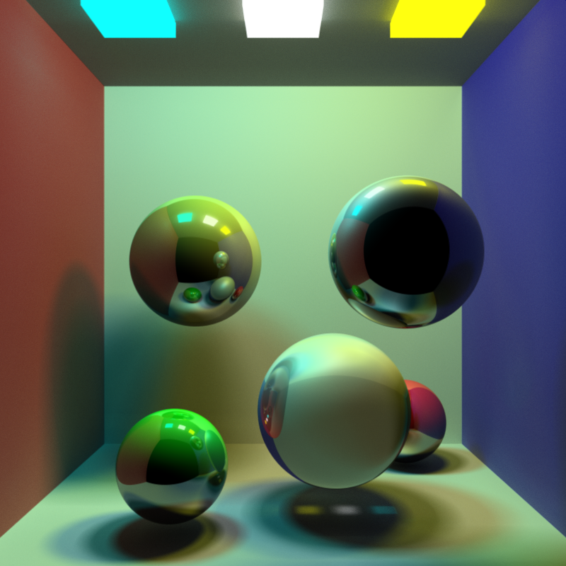

##Debug process
This is what I used to debug during my coding. I used different color to represent the normal vector of every point.
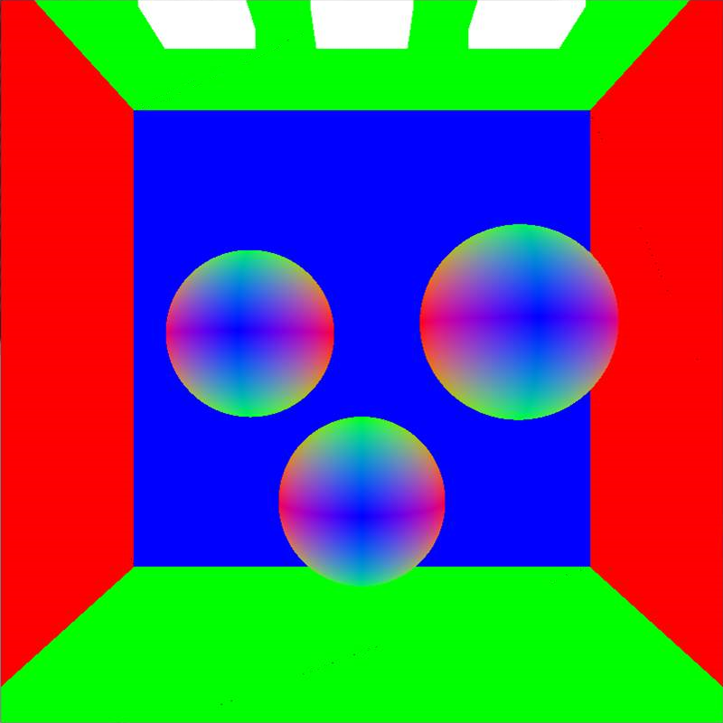

##Required time of each iteration and stream compaction result:
The required time for each iteration depends on several factors such as number of light source, number of object, object geometry, object material, and depth of trace.  
Besides, we could use stream compaction to shorten the required time of each iteration.  
The stream compaction effect will increase while the depth of trace increase.
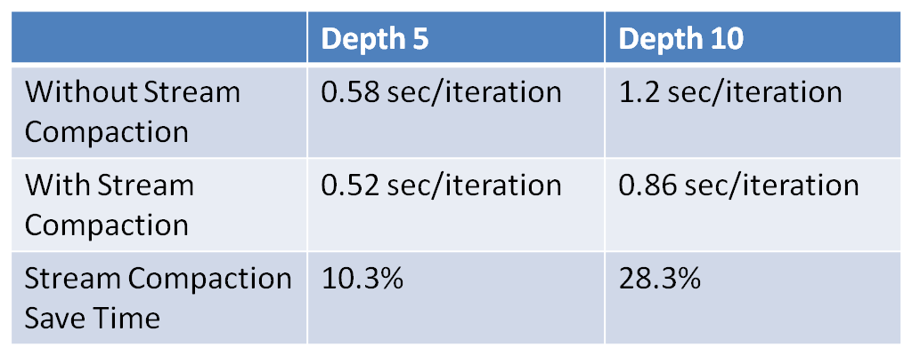
 The defect of my program right now is that when a ray hit into a transparent object and is trapped inside the object because of the total internal reflection, 
 it will bounce several times until it could escape from the object or exceed the maximum bounce depth. This process happens inside each iteration, and can not be speeded up by stream compaction.