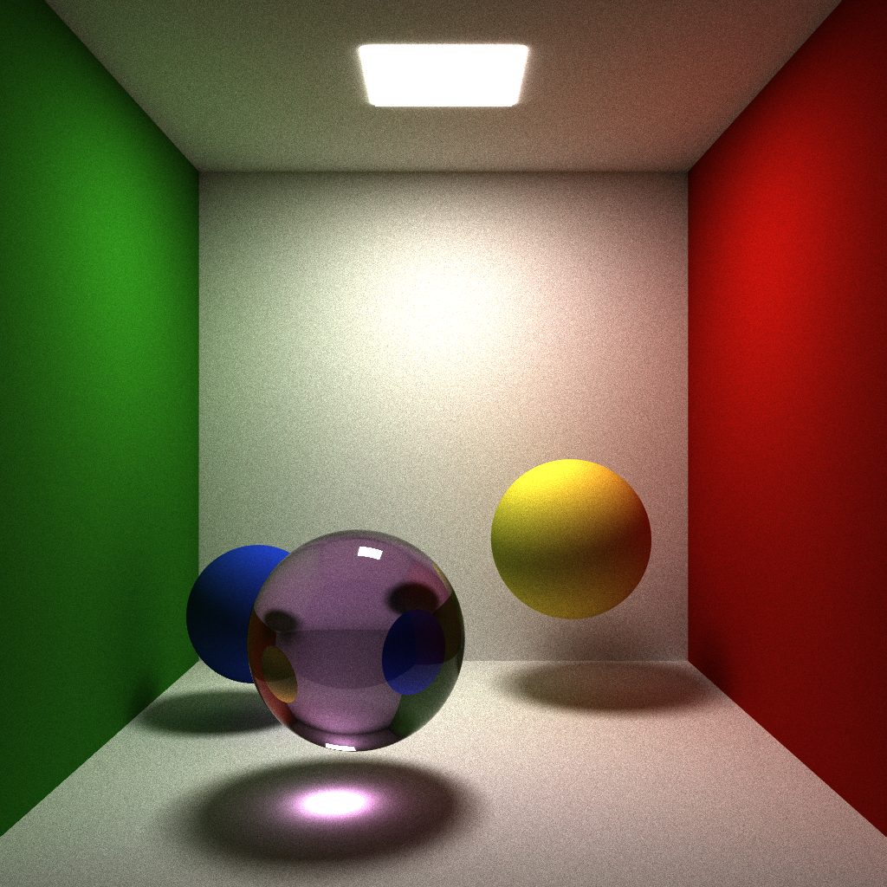
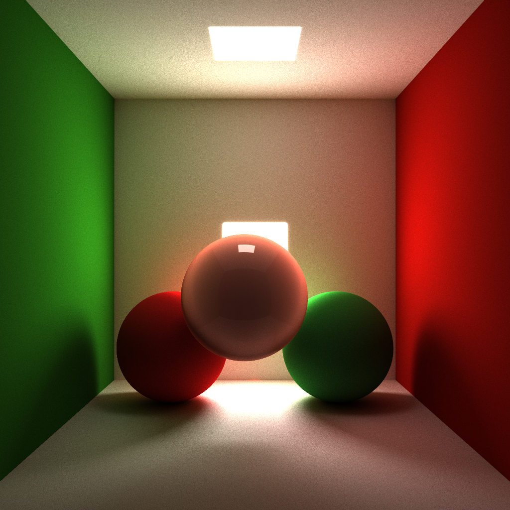
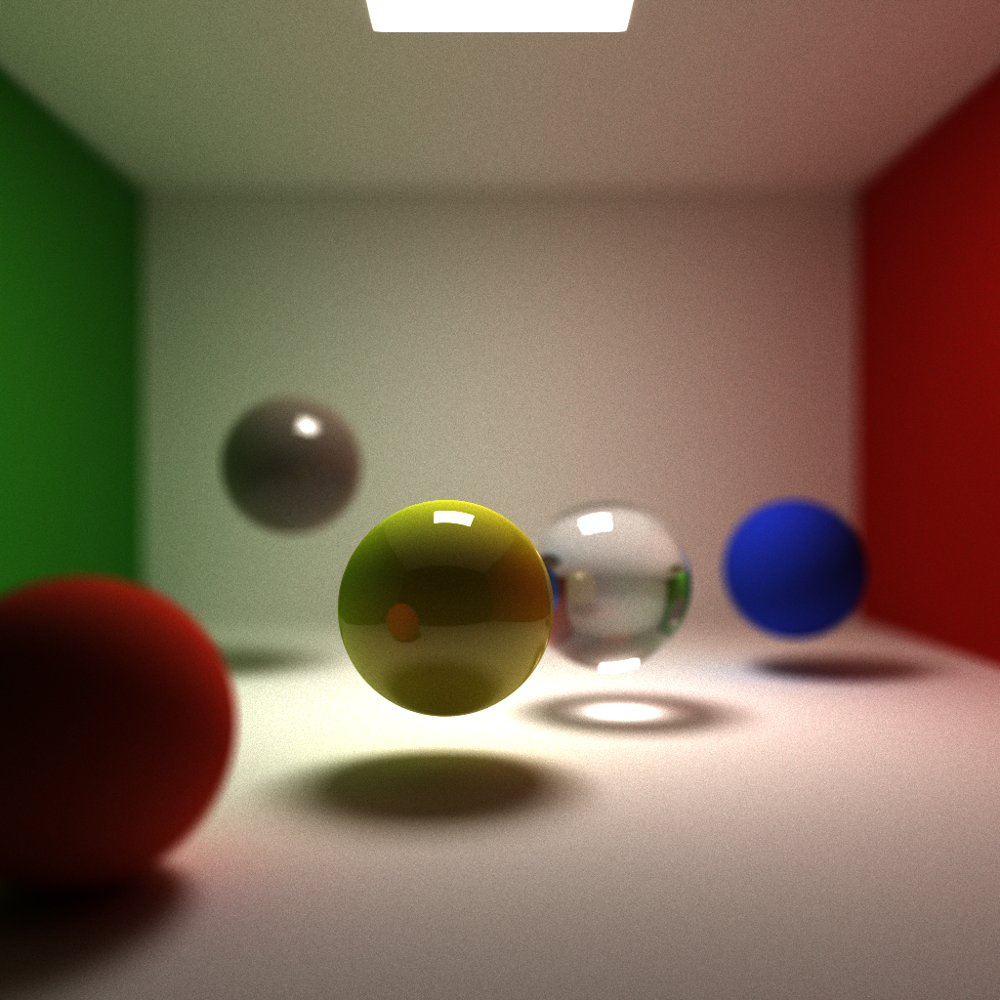
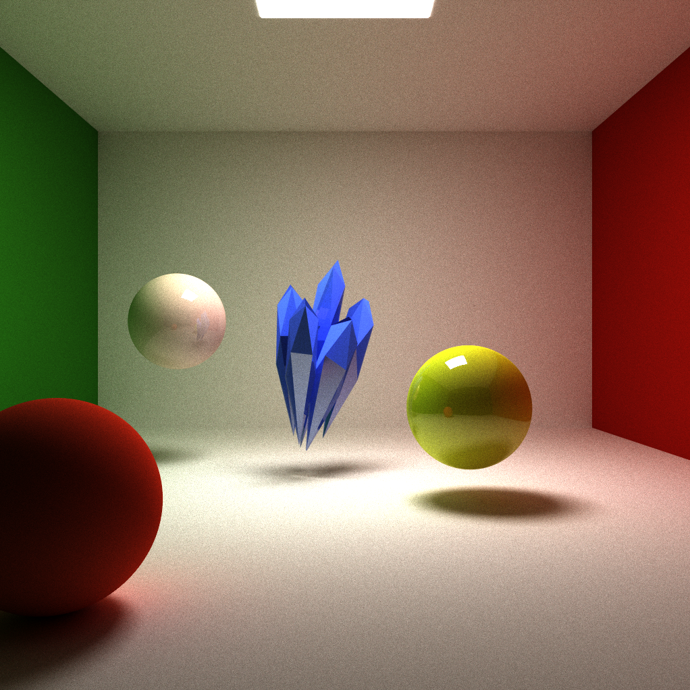
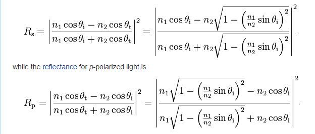
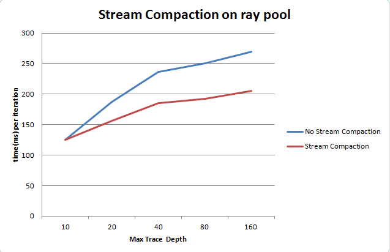

#CUDA Pathtracer

This is a standalone pathtracer implemented on the GPU using CUDA and OpenGL.
###Feature Highlights:
**Diffuse,Reflection, Refraction**

###Global Illumination,Soft Shadow, Caustics, Color Bleeding

###Fresnel Coefficients for reflection/refraction

###Subsurface Scattering

###Depth of Field

###Polygon Mesh Support

##Performance Features:

###Ray Parallel

Threads run on rays rather than pixels. For each pathtrace kernel call, all rays are in the same depth, each thread traces one ray one more depth. The advantage is that for rendering 
that requires very high depth, we could use stream compaction to remove "dead" rays during each kernel call to boost performance.

###Stream Compaction of Rays

Used thrust::copy_if to do the compaction. Double buffer swapping is used to avoid copy data twice.

##Feature Implementation Explained:

###softshadow,area light,color bleeding,global illumination

These features come "included" from the core pathtracing algorithm. For each ray, if it hits any surface it will bounce according to the BSDF funtion if returns a color when it hits light or doesn't 
intersect any object or max depth is reached.

###Diffuse,Reflection, Refraction, caustics ("free")

For diffuse surface, cosine weighted random Hemisphere sample is used to determine scattered direction.
Reflection and refraction uses Fresnel coefficients to determine proportion of reflected and refracted ray.
   Assuming light unpolarized

   

   use 1/2 (RS + RP) to get coefficient for reflection
  
###Depth of Field 

This is achieved by giving eye position an aperture instead of a single point and set image plane at focal length. Camera shoots out random rays within aperture of the eye position.

###Subsurface Scattering
It is a depth based subsurface scattering approximation. Rays hitting the surface will compute both entry and exit point on the object, then keep tracing from the exit point and the returned color
will be discounted by the distance between entry and exit point by an exponential function. Advantages of this implementation is: little performance impact, and good result of back lit situation. 
Weakness: not physically accurate, and less convincing in front lit situation.	

###Polygon Mesh Rendering
Implemented triangle intersection test function. Uses TinyObjLoader to read Obj file. 

###Super-Sampling Anti-Alisasing
Jittered pixel position while shooting camera rays.

###Performance Analysis
The data is produced from a scene in a cornell box and with three spheres, a pure diffuse, a reflective and a refractive one. Resolution was 1024 x 2014.

From the graph we can see when depth is greater than 10, stream compaction begins to be in advantage. The higher the depth the more advantage stream compaction has.
This is probably because when depth is low, overhead and data copying time in stream compaction exceeds the time saved. In addition, I expect stream compaction to have even greater
advantage when the scene is more sparse, i.e. lots of camera rays do not hit anything.

