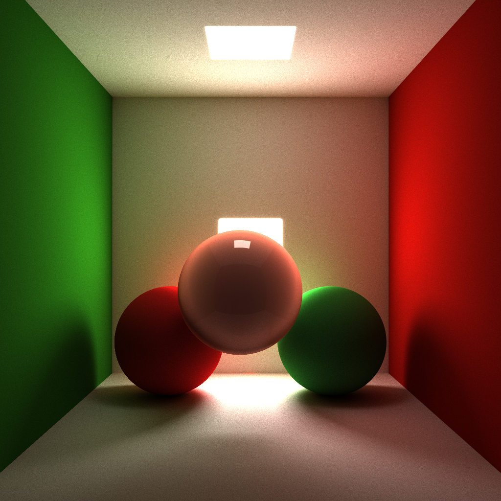

#CUDA Pathtracer

This is a standalone pathtracer implemented on the GPU using CUDA and OpenGL.

###Features:

  -####softshadow
  -####area light
  -####color bleeding
  -####global illumination

  -####Ray 
parallel instead of pixel parallel more maximum performance

  -####Stream
compaction on rays for each depth level (use thrust library)

  -####BSDF using Russian Roulette 
  
  -####Depth of Field, by jittering eye position and set image plane at focal length

  -####Fresnel Coefficients for reflection/refraction

   Assuming light unpolarized

   

   use 1/2 (RS + RP) to get coefficient for reflection

  -####Caustics (free from above)

  -####Obj loading (using tinyObjLoader), polygon mesh rendering

  -####Anti-Alisasing jittered pixle position

###Result:

###Performance Analysis

