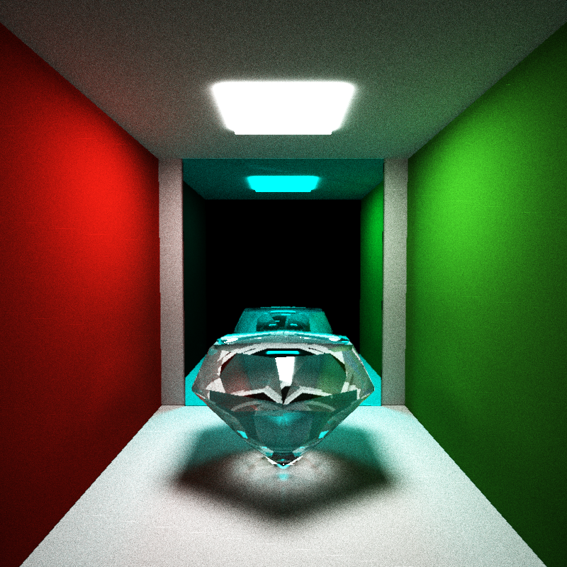

CIS 565 Project3 : CUDA Pathtracer
===================

## INTRODUCTION
This is a CUDA based Monte-Carlo Path tracer that renders images of different objects(sphere, cube, obj file) 
in various materials including diffuse, reflection, refraction, and more in the future. The render window will show 
real-time rendering progress (like other renderers do:) ), and camera angle can be changed at real-time to allow interesting shots!
To run my code in visual studio, press "ctrl+F5 ", sometimes, the renderer will stuck at 46 frame for certain scene (for instance, myScene.txt) but sometimes it works perfectly if restart the rendering without changing anything. So just keep trying.
I definitely need to fix this in the future.

## BACIC FEATURES

* Raycasting from a camera into a scene through a pixel grid  
	Using jittered coordinates to achieve Anti-Aliasing, and this effect is obvious when using small resolution, and less obvious when using large resolution.  
	
* Diffuse surfaces  
Using Hemi sphere sampling to cast secondary diffuse rays. I used Importance Sampling (cos weighted) to reduce noise and speed up convergence. 
shading is done by simplest Lambert BRDF.

* Perfect specular reflective surfaces  
Calculating reflected secondary ray by vector math

* Cube intersection testing  
My cube intersection is based on 
http://www.scratchapixel.com/lessons/3d-basic-lessons/lesson-7-intersecting-simple-shapes/ray-box-intersection/ 

* Sphere surface point sampling  
Monte-Carlo Sampling. 

* Stream compaction optimization  
Stream compaction was done by thrust, fast and reliable:)
This can be turned on or off by defining "STREAM_COMPACTION" in "raytracerKernel.h"  
The maximum limit of ray depth impacts the rendered speed, and this limit can be set in "MAX_DEPTH" in "raytracerKernel.h"  

The comparison between using and not using stream compaction is shown below  

## ADVANCED FEATURES

## Refraction, i.e. glass  
Refraction was done based on snell's law and fresnel equation.
Using good index of refraction will produce beautiful refractions.
Both clear glass or colored glass can be handled here. Wondering doing some frosted glass(play with transparency)in the future.  
The picture below shows three material - diffuse, highly reflective, and refractive glass.
 

##Texture Mapping  
Image loading is done through FreeImage. Basic texture mapping for cube and sphere is done.  
 

##Depth of field  
Depth of filed was achieved by offsetting initial pinhole ray origin based on camera aperture, and re-calculate the ray direction based on previous focal plane intersecting point.
Thus, the ray casting mimics the lens-based camera and produces depth of field effect where objects out of focus is blurred.  

Turning on/off "DEPTH_OF_FIELD" in "raytracerKernel.h" will switch the effect on/off

REMEMBER to specify camera "FOCAL" and "APERTURE" in scene txt file no matter using Depth of Field or not, like illustrated below, otherwise my program will have error in reading txt file lines  
  
CAMERA   
RES         800 800  
FOVY        35  
ITERATIONS  5000  
FILE        test.bmp  
FOCAL 8.2  
APERTURE 1.3  
frame 0  
EYE         0 4.5 8  
VIEW        0 0 -1  
UP          0 1 0  
      
Choosing good focal length and aperture is essential to create realistic depth of field.   
I have three rendered image as below, first everything is in focus (without depth of field), 
second with longer focal length, so further objects are in focus, the third with shorter focal length, hence nearer objects are in focus. 

##OBJ Mesh loading and rendering  
OBJ loading is possible with the help of "TinyObjLoader" by https://github.com/syoyo/tinyobjloader.
The obj data is parsed "mesh" with both "indices" and "positions". This saved me a lot of time in reading the obj file.

Then I created a structure "triangle" to handle face structure of mesh, and during intersection test, 
each of triangle will only be tested if the bounding box is intersecting the ray. This is very important as it will take A LOT OF TIME without bounding box intersection.

But, my renderer can only handle one obj instead of multiple obj, at current stage. (i.e only one objects in the scene can be specified by obj file, not more. 
but with other basic shape like sphere or cube is okay.) As I failed in adding the list of triangle to the member of "geom" and readable by CUDA. 
This can be solved by expanding my current global array of triangle to an array of triangle list. I should implement this in the near future.  

In order to load obj, speify the scene file as below. REMEMBER to include FULL PATH for the obj file, so that TinyObjLoader can correctly finds the file.  
I have two renders below, 166 and 437 triangle faces respectively, each took 40 minutes, and 80 minutes to render, which is still too slow for a renderer. 
In the future, I should implement Kd tree to speed up the rendering for polygonal meshes.     

OBJECT 5  
C:\Users\AppleDu\Documents\GitHub\Project3-Pathtracer\data\scenes\hexGem.obj  
material 5  
frame 0  
TRANS       0 1.1 -0.5  
ROTAT       0 0 0  
SCALE       4 4 4  

##Interactive camera  
Interactive Camera is implemented to provide flexible in rendering angles, including pan, tilt, zoom, everything. 
Play with camera like a camera man! :) Rendering will start fresh every time camera is changed. This allows interactive adjustment to camera angle, and make interesting shots possible.    

"STEP_SIZE" specifies the step size of camera movements, and can be changed in "main.h".  
The keyboard interaction during run-time is as specified below. In the future, I will include real-time modification of camera focal length and aperture as well, so that I can produce a good and realistic depth of field effect.  

* W - move up
* Q - move down
* S - move left
* D - move right
* Q - move forward (zoom in)
* E - move backward (zoom out)
* up - rotate up
* down - rotate down
* left - rotate left
* right - rotate right
* , - rotate CCW
* . - rotate CW

[] (http://www.youtube.com/embed/RtjJXwnUBZo)

##Compare to CPU Ray Tracer  
There are tons of advantages this rendered has over the CPU raytracer, such as  
* Much faster!   
* Real-time Rendering  
* Global Illumination ( Color Bleeding, Soft Shadow, & Caustics! )   
* Realistic Rendering ( BRDF )  

## SCENE FORMAT  
In order to use my program, "FOCAL" and "APERTURE" MUST be specified for camera in the scene file, 
though depth of field may not be turned on. This is to ensure correctness of reading in scene txt file.
I have some scene files that are interesting to render:  
* sampleScene.txt  
Original file  

* myScene.txt  
There is diffuse item, highly reflective item, glass item, depth of field.
with only one cube for Anti-Aliasing test  

* myScene1.txt  
Demonstrating basic materials - diffuse, reflection, and refraction  

* myScene2.txt  
Diamond obj with white glass material  

* myScene3.txt  
Crystal obj with blue glass material  

************************************************************
This project uses a custom scene description format.
Scene files are flat text files that describe all geometry, materials,
lights, cameras, render settings, and animation frames inside of the scene.
Items in the format are delimited by new lines, and comments can be added at
the end of each line preceded with a double-slash.

Materials are defined in the following fashion:

* MATERIAL (material ID)								//material header
* RGB (float r) (float g) (float b)					//diffuse color
* SPECX (float specx)									//specular exponent
* SPECRGB (float r) (float g) (float b)				//specular color
* REFL (bool refl)									//reflectivity flag, 0 for
  no, 1 for yes
* REFR (bool refr)									//refractivity flag, 0 for
  no, 1 for yes
* REFRIOR (float ior)									//index of refraction
  for Fresnel effects
* SCATTER (float scatter)								//scatter flag, 0 for
  no, 1 for yes
* ABSCOEFF (float r) (float b) (float g)				//absorption
  coefficient for scattering
* RSCTCOEFF (float rsctcoeff)							//reduced scattering
  coefficient
* EMITTANCE (float emittance)							//the emittance of the
  material. Anything >0 makes the material a light source.

Cameras are defined in the following fashion:

* CAMERA 												//camera header
* RES (float x) (float y)								//resolution
* FOVY (float fovy)										//vertical field of
  view half-angle. the horizonal angle is calculated from this and the
  reslution
* ITERATIONS (float interations)							//how many
  iterations to refine the image, only relevant for supersampled antialiasing,
  depth of field, area lights, and other distributed raytracing applications
* FILE (string filename)									//file to output
  render to upon completion
* frame (frame number)									//start of a frame
* EYE (float x) (float y) (float z)						//camera's position in
  worldspace
* VIEW (float x) (float y) (float z)						//camera's view
  direction
* UP (float x) (float y) (float z)						//camera's up vector

Objects are defined in the following fashion:
* OBJECT (object ID)										//object header
* (cube OR sphere OR mesh)								//type of object, can
  be either "cube", "sphere", or "mesh". Note that cubes and spheres are unit
  sized and centered at the origin.
* material (material ID)									//material to
  assign this object
* frame (frame number)									//start of a frame
* TRANS (float transx) (float transy) (float transz)		//translation
* ROTAT (float rotationx) (float rotationy) (float rotationz)		//rotation
* SCALE (float scalex) (float scaley) (float scalez)		//scale

