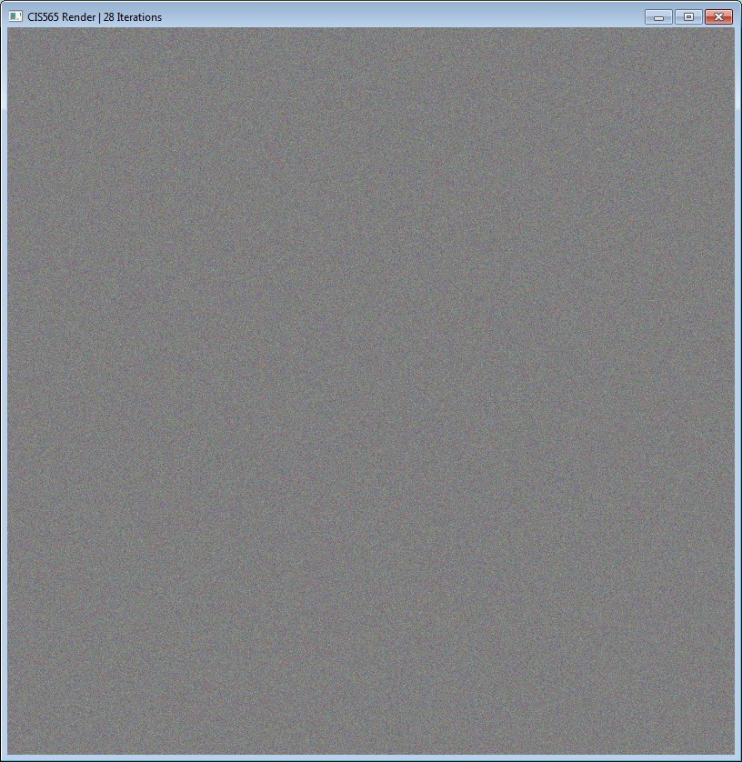
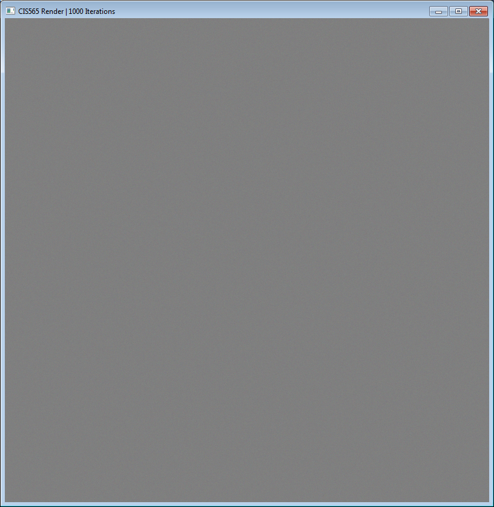
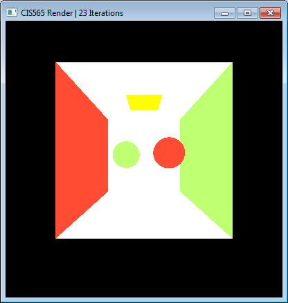
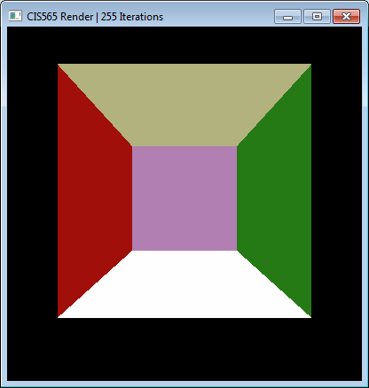
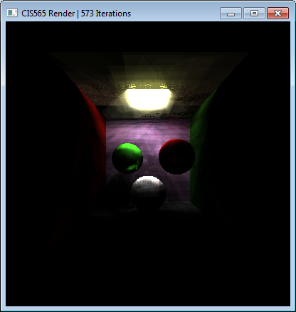
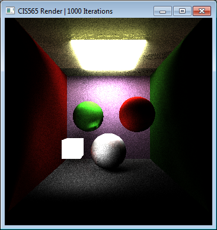
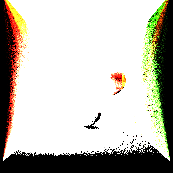
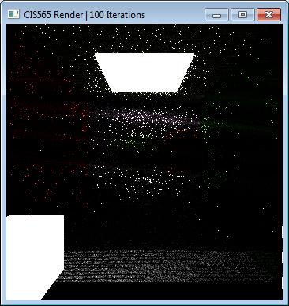
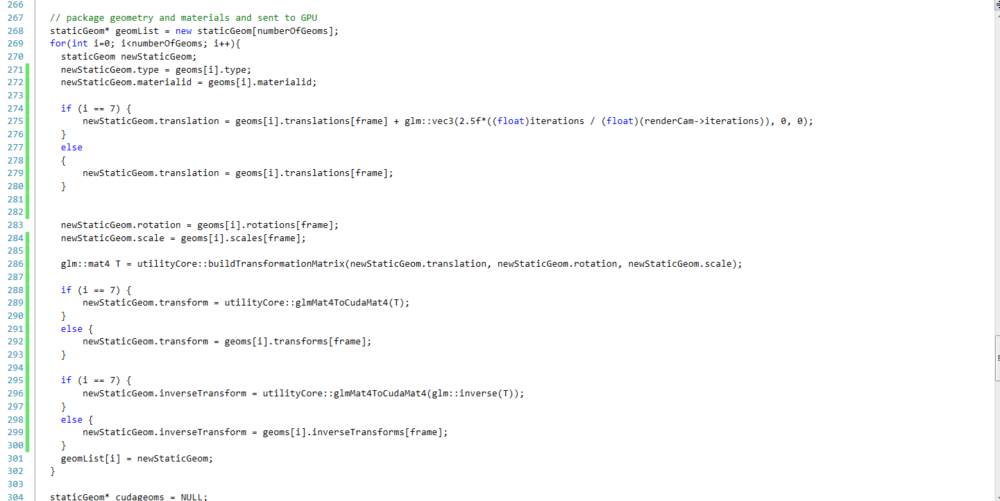
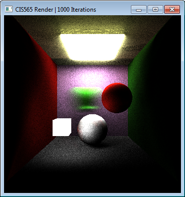

CIS 565 Project 3: CUDA Pathtracer
==================================

#### Michael Li

### _Overview_

This is my (rather unsuccessful) attempt to rebuild parts of a pathtracer that was
designed for CIS565 2 years ago as a final project.

Pictures follow in the wall of text below.

### _Details on what I implemented_

##### getRandomPointOnSphere()

Used:

* http://mathworld.wolfram.com/SpherePointPicking.html
* http://tutorial.math.lamar.edu/Classes/CalcIII/SphericalCoords.aspx

##### boxIntersectionTest()

Makes use of a helper function "planeIntersectionTest()". I've implemented this
stuff in CIS 560 before so the code is being reused here.

See:

* http://www.siggraph.org/education/materials/HyperGraph/raytrace/rayplane_intersection.htm
* https://github.com/citizen-of-infinity/SCHOOL-CIS-560-Raytracer/blob/master/CIS560hw2/intersect.cpp
* Slide 793 in the FALL 2013 notes for CIS 560 - basically, using ^-1^T to correctly
  map the normal from normalized space to world space. 
    * Addendum: this actually turned out not to work because CUDA is too sensitive
	  about using glm function in a "__host__ __device__" function like boxIntersectionTest().
	  I bypassed this issue by calculating the real normal in planeIntersectionTest().

##### getRandomDirectionInSphere()

It is *incredibly* unclear what is supposed to be going on with this function
and with calculateRandomDirectionInHemisphere(). There is not a single bit of
useful documentation in the code provided, and it becomes clear that neither
of these two "random" functions is random in the slightest. Through some testing
in the main() function I was able to determine that
calculateRandomDirectionInHemisphere() expects its 2 float inputs to be between
0 and 1, and I will do the same for this function. In that case, it's almost the
same thing as getRandomPointOnSphere().
  

##### calculateBSDF

For simplicity, I only support scattering and reflection. Not too sure about some
of the math either, so I guess I'm just making stuff up (research takes too
much effort... XP)

Essentially, perfect reflection uses the standard formula for reflection;
diffuse uses calculateRandomDirectionInHemisphere().

This function also does some sort of weird math (inspired by Wikipedia) for
diffuse intersections, based on "Lambertian reflection". Unfortunately the
specifics of how to do this was never discussed in class, so I've kind of just
made things up. You really should **not** bet that this path tracer does any conservation
of energy correctly or whatever.

With help from:

* https://www.cs.unc.edu/~rademach/xroads-RT/RTarticle.html
* http://en.wikipedia.org/wiki/Path_tracing#Algorithm
* Slide 701 from CIS 560 Fall 2013 notes (formula for Lambertian diffuse shading)

##### raytraceKernel.cu work

Since 2 of the 3 incomplete functions I need to finish up are dependent on each other,
I'll be working on them at the same time.

The third function, **raycastFromCameraKernel()**, is very similar to previous work I did in CIS 560.
See https://github.com/citizen-of-infinity/SCHOOL-CIS-560-Raytracer/blob/master/CIS560hw2/SceneGraph.cpp
starting at line 655. In fact, the implementation here is simpler since fov-x
and fov-y are both already available to me.

I decided to proceed in a series of checkpoints to make debugging easier.

###### Checkpoint 1:

Fix how cudaimage/colors and the PBO work so that the colors[] array now ACCUMULATES the value
it gets on each iteration, and make sure the right stuff is sent to the PBO and
the .bmp output.

This causes the screen to display an ever-more featureless gray as the iteration
count increases, as expected. (Over time, a bunch of random colors averages out
to 50% gray.) The static is no longer completely "fresh" with each iteration.

The output .bmp file exactly matches the last screenshot above (I capped
ITERATIONS to 1000 to make things faster).

###### Checkpoint 2:

Deterministically initialize all rays from camera (use raycastFromCameraKernel())
and have them return the color of the first thing they intersect.

I already have some ideas as to what this should look like, based on posts from
other students on the forums.

It works! (Though my implementation is obviously terribly inefficient, so I had
to quarter the resolution.)

Note that since each iteration returns the same thing, there is no change if I
leave the pathtracer to run for multiple iterations.

###### Checkpoint 3:

Look like a real pathtracer, but no stream compaction opt or motion blur yet.

I'm running into trouble - my image is black where the walls should be.

However, I'm pretty sure my box intersection testing is right... check out this
debug view that just returns material color:

I guess something might be wrong with the normals I am getting... and the debug
view showed that I was getting nothing back at all (just a black screen)!

Upon fixing this, my walls were showing up, but coming back really dark:

I was unable to fix this, and consequently, decided to throw in a few extra emitting
cubes in different parts of the scene to make stuff brighter.
I also played around with my thrust RNG - there was a bug where the same seed was
being used for each pixel in an iteration, causing a weird non-static-like convergence
(it was more like chunks of objects lit up all at once).

The end result was something like this. 

For some reason, the bmp output looked completely different:

(It seems like it failed to divide by the number of iterations, since there's
a lot of white. This tells me that any black area on the output is a place where
the ray absolutely never hit the light. I don't know if this has to do with the
hemisphere function or what, but I'm completely clueless as to what the cause
might be.)

At this point, I've decided to stop and focus on motion blur / stream compaction
in the few remaining hours I have.

#### Stream compaction

**Important: remember to change the #blocks launched with each call of raytraceRay.
Otherwise I'll end up with lots of wasted cycles anyway because I'll launch kernels
for rays that don't exist.

Stream compaction is made possible by adding "source_index" attributes to the
ray struct, which allows rays to be culled without losing their corresponding
index location.

Here's an output for 100 interations I got that seems almost right - but it's much too dark, even for
100 iterations. If stream compaction were implemented correctly, it should be exactly
the same, right?

Going up to 1000 iterations changes little.

The work shows up in 3 places in the code:

* relabeling of the indexes in raytraceRay()
* NUM_BLOCKS changes near the while loop in cudaRaytraceCore()
* the new void function cullRays (this is NOT a kernel or __device__ function!)

### _Extra feature analysis_

["extra features", performance analysis]

#### Motion blur

I'm going to hardcode in motion blur for object 7, the green sphere. The blur will
be a movement 2.5 units to the right.

This was done by adding an if-else wrappers around particular points in
cudaRaytraceCore() - specifically, the exact lines where the green sphere's
translation, transformation matrix, and inverse transformation matrix are specified
(right before being sent to device CUDA memory). These are then redefined, using
[scene.cpp](https://github.com/citizen-of-infinity/Project3-Pathtracer/blob/master/src/scene.cpp)
for guidance.

Here's the implementation change (this is NOT good code; if I had more time
it would be a good idea for me to pull this stuff out into a more general function):

And here's the end result:

The version I implemented has little performance impact. The way it is calculated,
it already takes place on the CPU. There's probably a smarter way to do this on
the GPU that does not involve recalculating a matrix with each iteration, but I
can't think of it right now.

### _Overall comments_

[Potential ideas for better optimization]

I'd like to say that the Moore 100C computers are just slow, but it still seems
likely that my implementation is not that good - after all, I had to decrease
the resolution a LOT (first to 400 x 400, then 350 x 350) to get the thing
to run at a reasonable pace.

I can identify the following areas of redundancy in the code:

* deleting/repackaging stuff to send to/from CUDA on each iteration - while this
  was obviously important it making it very easy to implement motion blur, I still
  feel there may be a better way to handle the data at the front of cudaRaytraceCore()
  than just copying it fresh for each iteration.
* stream compaction requires kernel calls. If the number of finished rays is very
  low, then perhaps it isn't worth it to cull just those rays. So, conditioning
  the call for stream compaction may result in better performance.

Also, stream compaction overhead may not be worth it if, for example, we're
shooting rays around in an enclosed box with lights all over the place, as
all the rays will terminate soon/take around the same number of bounces to terminate.
