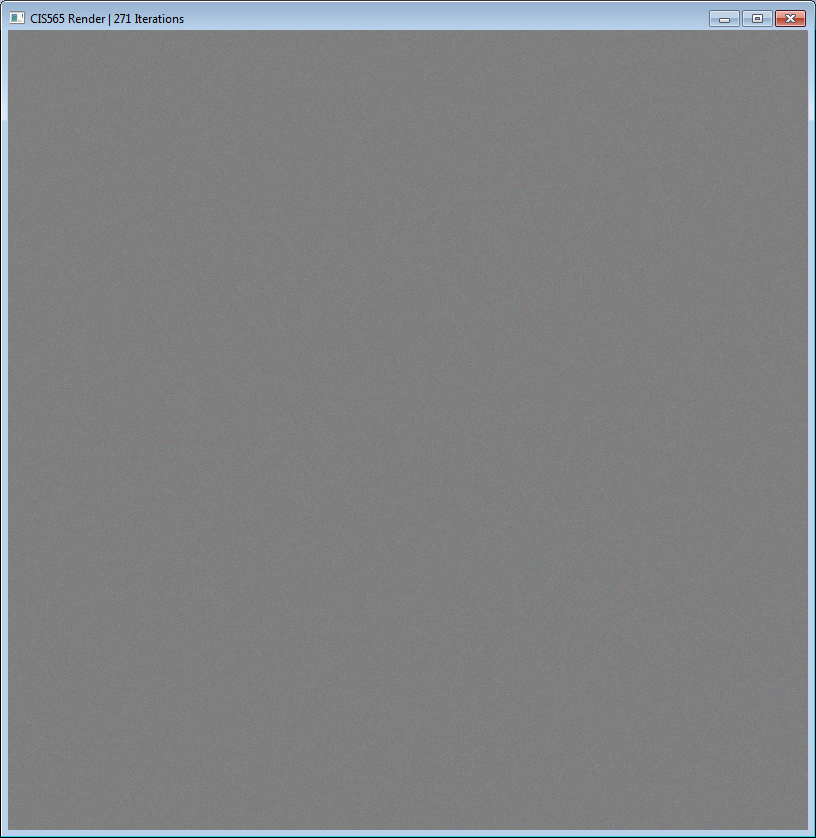

CIS 565 Project 3: CUDA Pathtracer
==================================

#### Michael Li

### _Overview_

[Text overview, some pictures.]

### _Details on what I implemented_

##### getRandomPointOnSphere()

Used:

* http://mathworld.wolfram.com/SpherePointPicking.html
* http://tutorial.math.lamar.edu/Classes/CalcIII/SphericalCoords.aspx

##### boxIntersectionTest()

Makes use of a helper function "planeIntersectionTest()". I've implemented this
stuff in CIS 560 before so the code is being reused here.

See:

* http://www.siggraph.org/education/materials/HyperGraph/raytrace/rayplane_intersection.htm
* https://github.com/citizen-of-infinity/SCHOOL-CIS-560-Raytracer/blob/master/CIS560hw2/intersect.cpp
* Slide 793 in the FALL 2013 notes for CIS 560 - basically, using ^-1^T to correctly
  map the normal from normalized space to world space.

##### getRandomDirectionInSphere()

It is *incredibly* unclear what is supposed to be going on with this function
and with calculateRandomDirectionInHemisphere(). There is not a single bit of
useful documentation in the code provided, and it becomes clear that neither
of these two "random" functions is random in the slightest. Through some testing
in the main() function I was able to determine that
calculateRandomDirectionInHemisphere() expects its 2 float inputs to be between
0 and 1, and I will do the same for this function. In that case, it's almost the
same thing as getRandomPointOnSphere().
  

##### calculateBSDF

For simplicity, I only support scattering and reflection. Not too sure about some
of the math either, so I guess I'm just making stuff up (research takes too
much effort... XP)

Essentially, perfect reflection uses the standard formula for reflection;
diffuse uses calculateRandomDirectionInHemisphere().

This function also does some sort of weird math (inspired by Wikipedia) for
diffuse intersections, based on "Lambertian reflection". Unfortunately the
specifics of how to do this was never discussed in class, so I've kind of just
made things up. You really should **not** bet that this path tracer does any conservation
of energy correctly or whatever.

With help from:

* https://www.cs.unc.edu/~rademach/xroads-RT/RTarticle.html
* http://en.wikipedia.org/wiki/Path_tracing#Algorithm
* Slide 701 from CIS 560 Fall 2013 notes (formula for Lambertian diffuse shading)

##### raytraceKernel.cu work

Since 2 of the 3 incomplete functions I need to finish up are dependent on each other,
I'll be working on them at the same time.

The third function, **raycastFromCameraKernel()**, is very similar to previous work I did in CIS 560.
See https://github.com/citizen-of-infinity/SCHOOL-CIS-560-Raytracer/blob/master/CIS560hw2/SceneGraph.cpp
starting at line 655. In fact, the implementation here is simpler since fov-x
and fov-y are both already available to me.

I decided to proceed in a series of checkpoints to make debugging easier.

###### Checkpoint 1:

Fix how cudaimage/colors and the PBO work so that the colors[] array now ACCUMULATES the value
it gets on each iteration, and make sure the right stuff is sent to the PBO and
the .bmp output.

This causes the screen to display an ever-more featureless gray as the iteration
count increases, as expected. (Over time, a bunch of random colors averages out
to 50% gray.) The static is no longer completely "fresh" with each iteration.

The output .bmp file exactly matches the last screenshot above (I capped
ITERATIONS to 1000 to make things faster).

###### Checkpoint 2:

Deterministically initialize all rays from camera (use raycastFromCameraKernel())
and have them return the color of the first thing they intersect.

I already have some ideas as to what this should look like, based on posts from
other students on the forums.

### _Extra feature analysis_

["extra features", performance analysis]

### _Overall comments_

[Potential ideas for better optimization]
